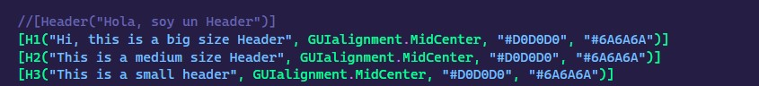
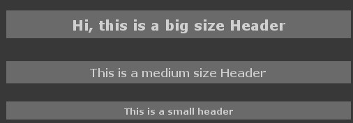
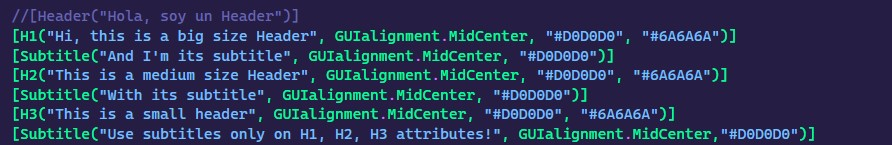
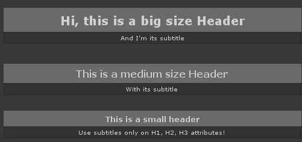
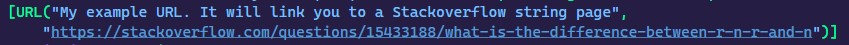
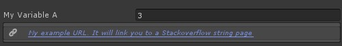
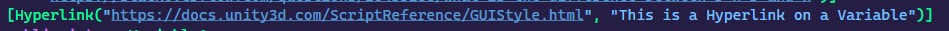
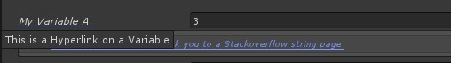
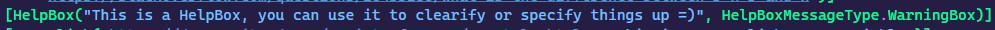
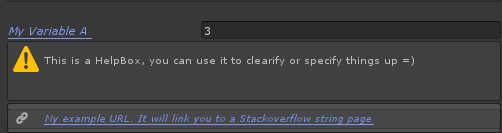

# Unity-Attributes-Essentials
Welcome to the Unity Attributes Essentials package! 🎮

This package provides a collection of essential custom attributes for Unity, designed to enhance your workflow and improve the organization of your scripts. Included are attributes such as Headers, Help Boxes, and Hyperlinks to make your code more readable and maintainable.

I'll be regularly updating this repository as I upload YouTube videos explaining the basics of these attributes and how to effectively use them in your Unity projects. Stay tuned for more content and features!

PD: The videos are in spanish, if I recieve enough support on this package I will consider doing english versions too! =)

Happy coding! 🚀

# Changelog
- Added 3 new Attributes 26 / August / 2024
  * LineDecorator Attribute
  * Quick Note Attribute
  * Notes Attribute
    
- Added 7 new Attributes 19 / August / 2024
  * Header 1 Attribute
  * Header 2 Attribute
  * Header 3 Attribute
  * Subtitle Attribute
  * HelpBox Attribute
  * URL Attribute
  * Hyperlink Attribute

# Usage of H1, H2, H3 Attributes
H1, H2, H3 Attribute Constructors

```c#
//You can use it just like Unity's [Header("")], it is bigger tho

[H1("This is a header 1")]
public int someVariable;
```
```c#
/*You can customize the Text and BackgroundColor, the HEX strings are OPTIONAL
  to place, you can even only put the HEX_TextColor if you want*/

[H1("This is a header 1", "#HEX_TextColor", "#HEX_BackgroundColor")]
public int someVariable;

[H1("This is a header 1", "#HEX_TextColor")]
public int someVariable;
```
```c#
/*You can customize the TopSpacing as well like this, the HEX strings are OPTIONAL
  to place, you can even only put the HEX_TextColor if you want*/

[H1("This is a header 1", (float) spacing, "#HEX_TextColor", "#HEX_BackgroundColor")]
public int someVariable;

[H1("This is a header 1", (float) spacing, "#HEX_TextColor")]
public int someVariable;

[H1("This is a header 1", (float) spacing)]
public int someVariable;
```
```c#
/*You can customize the Alignment as well like this, the HEX strings are OPTIONAL
  to place, you can even only put the HEX_TextColor if you want. I'm covering what
  GUIalignment is and how to use it below*/

[H1("This is a header 1", GUIalignment, "#HEX_TextColor", "#HEX_BackgroundColor")]
public int someVariable;

[H1("This is a header 1", GUIalignment, "#HEX_TextColor")]
public int someVariable;

[H1("This is a header 1", GUIalignment)]
public int someVariable;
```
```c#
/*Or you can customize all at once like this, the HEX strings are OPTIONAL
  to place, you can even only put the HEX_TextColor if you want. I'm covering what
  GUIalignment is and how to use it below*/

[H1("This is a header 1", (float) spacing, GUIalignment, "#HEX_TextColor", "#HEX_BackgroundColor")]
public int someVariable;

[H1("This is a header 1", (float) spacing, GUIalignment, "#HEX_TextColor")]
public int someVariable;

[H1("This is a header 1", (float) spacing, GUIalignment)]
public int someVariable;
```

H1, H2, H3 works the same way. So it is pretty much the same

* For example *

```c#
[H1("This is a header 1", (float) spacing, GUIalignment, "#HEX_TextColor", "#HEX_BackgroundColor")]
public int someVariable;

[H2("This is a header 2, a little bit smaller than header 1", (float) spacing, GUIalignment, "#HEX_TextColor")]
public int someVariable;

[H3("This is a header 3, the smallest of all of the Headers", (float) spacing, GUIalignment)]
public int someVariable;
```
BE CAREFUL, both the Text and Background HEX colors won't work if you dont put "#" at the begining
For example: "#FFFFFF"

- Captures

  
  
  
#  What is GUIalignment?
It is a enum holding various types of built-in alignments

```c#
GUIalignment.UpLeft => //Allign text to the UpperLeft part
GUIalignment.UpCenter => //Allign tex to the UpperCenter part
GUIalignment.UpRight => //Allign text to the UpperRight part

GUIalignment.MidLeft => //Allign text to the MiddleLeft part
GUIalignment.MidCenter => //Allign text to the MiddleCenter part
GUIalignment.MidRight => //Allign text to the MiddleRight part

GUIalignment.BottomLeft => //Allign text to the LowerLeft part
GUIalignment.BottomCenter => //Allign text to the LowerCenter part
GUIalignment.BottomRight => //Allign text to the LowerRight part
```

# Subtitle Attribute
The structure is simillar to H1, H2, H3 attributes
it doesnt have a spacing param and instead of HEX_BackgroundColor param, 
there is a bool that toggles a Box at the background
This bool's default value is true, but you can change it

This attribute gives either H1 or H2 or H3 a subtitle below.
The attribute MUST go BELOW either H1 or H2 or H3 attribute, or it will glitch through the inspector properties

Examples:

```c#
//This is one way to declare it with text string, alignment, text color, boolean drawBox

[H1("Title")]
[Subtitle("This is a header 1 subtitle", GUIalignment, "#HEX_TextColor", false)]
public int someVariable;
```
```c#
//This is another way to declare it with text string, alignment, hex color

[H3("Title Header 3")]
[Subtitle("With its subtitle", GUIalignment, "#HEX_TextColor")]
public int someVariable;
```
```c#
//This is another way to declare it with text string and hex color

[H3("Another Header3")]
[Subtitle("This time I won't specify alignment", "#HEX_TextColor")]
public int someVariable;
```
```c#
//This is another way to declare it with text string, hex color and boolean drawBox

[H2("A Header 2")]
[Subtitle("And now I don't want the Box", "#HEX_TextColor", false)]
public int someVariable;
```
- Captures

  
  
  
# URL Attribute
It creates a Field bellow the property with a text that will link to a webpage when clicked

This attribute wont allow multiple usage on one property
```c#
/*You place a string that will be the visible text and a string containing the link when clicked.
  Optionally, just like the Subtitle attribute, you can add a boolean if you want a box to be drawn*/

[URL("My example URL. It will link you to this repository. The Box is not drawn", 
    "https://github.com/FabRuju/Unity-Attributes-Essentials", false)]
public int someVariable;
```
```c#
//Or you can use the default value which is true and leave it blank

[URL("Now I want the Box to appear. I can either place the boolean 'true' or not", 
    "https://github.com/FabRuju/Unity-Attributes-Essentials")]
public int someVariable;
```
```c#
//You can play with alignment as well

[URL("I can also play with the alignment =), at the end will always be the drawBox boolean", 
    "https://github.com/FabRuju/Unity-Attributes-Essentials", GUIalignment, true)]
public int someVariable;
```
- Captures

  
  
  
# Hyperlink Attribute
It will make the property clickeable that will take you to a webpage
It contains a tooltip where you can put f.e. where the link is going to take you

It takes only 2 params and the las tone its optional (The tooltip), you can type in whatever you want
either way it will show the default tooltip "Click to go to the link"

This attribute wont allow multiple usage on one property
```c#
//A way to use it customizing the tooltip

[Hyperlink("https://github.com/FabRuju/Unity-Attributes-Essentials", "This is a Hyperlink on a Variable")]
public int someVariable;
```
```c#
//A way to use it without customizing the tooltip

[Hyperlink("https://github.com/FabRuju/Unity-Attributes-Essentials")]
public int someVariable;
```
- Captures

  
  
  
# HelpBox Attribute
It creates a Field bellow the property with a HelpBox
It uses an optional param which is HelpBoxMessageType which is an enum that I will explain bellow
The default value of this last param is set to Tooltip

This attribute wont allow multiple usage on one property

```c#
//This is a normal HelpBox with your text

[HelpBox("This is a HelpBox")]
public int someVariable;
```
```c#
//This is a HelpBox with a custom MessageType

[HelpBox("Wowsy, another HelpBox XD", HelpBoxMessageType)]
public int someVariable;
```

# What is HelpBoxMessageType?
It is a enum holding various types of built-in HelpBox skins

```c#
HelpBoxMessageType.EmptyBox => //No skin, a simple box drawed bellow the property
HelpBoxMessageType.WarningBox = //A warning skin, (The yellow Unity icon that sometimes is shown at the console)
HelpBoxMessageType.ErrorBox = //An error skin, (The red Unity icon that sometimes is shown at the console)
HelpBoxMessageType.InfoBox =  //The info skin (The gray Unity icon that is shown with Debug.Log)
```
- Captures

  
  

# LineDecorator Attribute

### About:
LineDecorator is a custom Unity attribute that allows you to draw a stylized line in the Unity Inspector, 
providing better visual organization and separation of properties. 
This attribute is useful for enhancing the readability of your inspector fields, especially in complex scripts.

### Features
* Customizable Line Style: Choose from predefined line styles to match your aesthetic or organizational needs.
* Custom Line Color: Specify a custom line color using a HEX code (default: #C0C0C0).
* Adjustable Spacing: Optionally add vertical spacing around the line to create more distinct sections in the inspector.

* Parameters
```c#
LineSkin lineStyle => //Enum to define the line's style
int spacing => //Integer to define the vertical space above and below the line.
string HEX_LineColor = "#C0C0C0" => //Optional parameter to define the line's color using a HEX code.
```
This attribute will create a Decorated Line Separator  
Uses a param which is LineSkin, it is an enum that I will explain bellow
It is possible to customize the spacing
You can customize the color of the decorator, but this last param its optional
Just like the other attributes you need to input the HEX color using '#' at the begining

This attribute allow multiple usage on one property

```c#
[LineDecorator(LineSkin lineStyle, string HEX_LineColor = "#C0C0C0")]

[LineDecorator(LineSkin lineStyle, int spacing, string HEX_LineColor = "#C0C0C0")]
```

# What is LineSkin
Enum holding various types of line skins (designs).

It contains 12 different designs.

```c#
LineSkin.Custom1  => //Skin 1
LineSkin.Custom2  => //Skin 2
LineSkin.Custom3  => //Skin 3
...
LineSkin.Custom12 => //Skin 12
```

# Coming Soon ...
