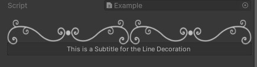
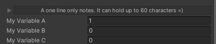
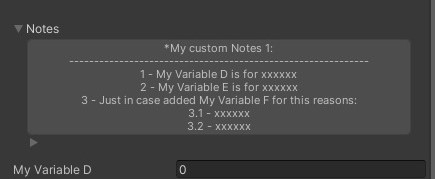

# Unity-Attributes-Essentials
Welcome to the Unity Attributes Essentials package! 🎮

This package provides a collection of essential custom attributes for Unity, designed to enhance your workflow and improve the organization of your scripts. Included are attributes such as Headers, Help Boxes, and Hyperlinks to make your code more readable and maintainable.

I'll be regularly updating this repository as I upload YouTube videos explaining the basics of these attributes and how to effectively use them in your Unity projects. Stay tuned for more content and features!

PD: The videos are in spanish, if I recieve enough support on this package I will consider doing english versions too! =)

Happy coding! 🚀

## Changelog
- Added 3 new Attributes 26 / August / 2024
  * LineDecorator Attribute
  * Quick Note Attribute
  * Notes Attribute
    
- Added 7 new Attributes 19 / August / 2024
  * Header 1 Attribute
  * Header 2 Attribute
  * Header 3 Attribute
  * Subtitle Attribute
  * HelpBox Attribute
  * URL Attribute
  * Hyperlink Attribute

# Documentation
## H1, H2, H3 Attributes
Attributes designed to enhance the visual organization of fields in the Unity Inspector by creating styled headers. 
These headers allow for better separation and labeling of different sections within the inspector, improving the readability and structure of your scripts.

> [!IMPORTANT]
> For the sake of order, I did not put all the documentation in the README.
> 
> I divided it into other pages for each attribute. 
> [Documentation here](Docs/HeaderAttributes.md)

### Captures
  
  
  
## Subtitle Attribute
SubtitleAttribute is a custom Unity attribute designed to display descriptive subtitles directly below H1 headers in the Unity Inspector. This attribute enhances the organization and readability of your inspector by providing additional context or instructions for specific sections of your scripts.

> [!IMPORTANT]
> For the sake of order, I did not put all the documentation in the README.
> 
> I divided it into other pages for each attribute. 
> [Documentation here](Docs/SubtitleAttribute.md)

### Captures

  
  
## Hyperlink Attribute
Hyperlink is a custom Unity attribute that turns a property's label in the Inspector into a clickable hyperlink. 
This attribute is particularly useful for adding documentation links, references, or external resources directly within your scripts, making it easier for users to access relevant information.

> [!IMPORTANT]
> For the sake of order, I did not put all the documentation in the README.
> 
> I divided it into other pages for each attribute. 
> [Documentation here](Docs/HyperlinkAttribute.md)

### Captures

  

## URL Attribute
URL is a custom Unity attribute that creates an interactive box bellow property in the Inspector, containing a clickable link icon next to custom text. 
When the box is clicked, the user is redirected to a specified URL. 
This attribute is ideal for adding reference links, documentation, or external resources directly in your scripts, making them easily accessible.

> [!IMPORTANT]
> For the sake of order, I did not put all the documentation in the README.
> 
> I divided it into other pages for each attribute. 
> [Documentation here](Docs/UrlAttribute.md)

### Captures

 
## HelpBox Attribute
HelpBoxAttribute is a custom Unity attribute designed to display informative, warning, or error messages directly in the Inspector. 
This attribute is useful for providing context, instructions, or alerts to users working with your scripts.

> [!IMPORTANT]
> For the sake of order, I did not put all the documentation in the README.
> 
> I divided it into other pages for each attribute. 
> [Documentation here](Docs/HelpBoxAttribute.md)

### Captures

  

## LineDecorator Attribute
LineDecorator is a custom Unity attribute that allows you to draw a stylized line in the Unity Inspector, 
providing better visual organization and separation of properties. 
This attribute is useful for enhancing the readability of your inspector fields, especially in complex scripts.

> [!IMPORTANT]
> For the sake of order, I did not put all the documentation in the README.
> 
> I divided it into other pages for each attribute. 
> [Documentation here](Docs/LineDecoratorAttribute.md)

### Captures

  

## Quick Notes Attribute
QuickNote is a custom Unity attribute that allows you to add and modify quick notes (One line up to 60 characters) directly in the Inspector. 
This attribute is particularly useful for adding reminders, instructions, or other important notes that you may need to repeat across multiple scripts without the need of re-writing.

> [!IMPORTANT]
> For the sake of order, I did not put all the documentation in the README.
> 
> I divided it into other pages for each attribute. 
> [Documentation here](Docs/QuickNoteAttribute.md)

### Captures

  

## Notes Attribute
Notes is a custom Unity attribute that allows you to add detailed, multiline notes directly in the Inspector. 
This attribute is ideal for writing longer notes, instructions, or documentation that can be edited and organized with ease and that you may need to repeat across multiple scripts without the need of re-writing.

> [!IMPORTANT]
> For the sake of order, I did not put all the documentation in the README.
> 
> I divided it into other pages for each attribute. 
> [Documentation here](Docs/NotesAttribute.md)

### Captures

  

# Coming Soon ...
